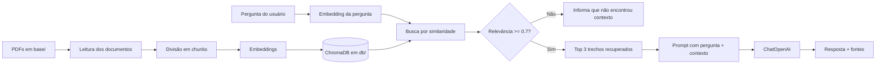

# Pergunte aos seus documentos

Aplicação de **RAG (Retrieval-Augmented Generation)** para fazer perguntas sobre documentos PDF locais. Os arquivos colocados na pasta `base/` são processados, transformados em vetores e armazenados em um banco vetorial ChromaDB. Quando o usuário faz uma pergunta, a aplicação recupera os trechos mais relevantes e os envia como contexto para um modelo da OpenAI gerar uma resposta fundamentada nos documentos.

> **Em uma frase:** coloque seus PDFs em `base/`, gere o índice e pergunte aos seus próprios documentos por uma interface Streamlit ou pelo terminal.

## Tecnologias

<p>
  <a href="https://www.python.org/"></a>
  <a href="https://streamlit.io/"></a>
  <a href="https://www.langchain.com/"></a>
  <a href="https://www.trychroma.com/"></a>
  <a href="https://openai.com/"></a>
</p>

| Tecnologia | Papel no projeto |
| --- | --- |
| [Python](https://www.python.org/) | Linguagem da aplicação e dos scripts de ingestão |
| [Streamlit](https://streamlit.io/) | Interface web para perguntas e respostas |
| [LangChain](https://www.langchain.com/) | Orquestração do carregamento, divisão, embeddings, recuperação e geração |
| [ChromaDB](https://www.trychroma.com/) | Banco vetorial persistido localmente em `db/` |
| [OpenAI Embeddings](https://platform.openai.com/docs/guides/embeddings) | Conversão de textos e perguntas em vetores semânticos |
| [OpenAI Chat Models](https://platform.openai.com/docs/guides/text-generation) | Geração da resposta final a partir do contexto recuperado |
| [pypdf](https://pypi.org/project/pypdf/) | Extração de texto dos arquivos PDF |
| [python-dotenv](https://pypi.org/project/python-dotenv/) | Leitura da variável `OPENAI_API_KEY` a partir do `.env` |

## O que é RAG?

RAG significa **Retrieval-Augmented Generation**, ou **Geração Aumentada por Recuperação**. É uma arquitetura que combina busca em uma base de conhecimento com um modelo de linguagem generativo.

Um modelo de linguagem, sozinho, não conhece automaticamente os documentos privados do usuário. Em vez de tentar treinar ou alterar o modelo, o RAG busca informações relevantes no momento da pergunta e acrescenta essas informações ao prompt enviado ao modelo.

O fluxo deste projeto é:



## Como o pipeline funciona

### 1. Ingestão e indexação

A indexação é executada por `criar_db.py`:

1. `PyPDFDirectoryLoader` lê todos os arquivos `*.pdf` encontrados em `base/`.
2. Cada página é carregada com metadados, incluindo o arquivo de origem e a página.
3. `RecursiveCharacterTextSplitter` divide o texto em partes menores, chamadas **chunks**.
4. Cada chunk é transformado em um vetor numérico por `OpenAIEmbeddings`.
5. Os vetores, textos e metadados são persistidos pelo Chroma em `db/`.

A configuração atual usa:

- `chunk_size=2000`: tamanho máximo aproximado de cada trecho.
- `chunk_overlap=500`: sobreposição entre trechos consecutivos para preservar contexto entre os limites de uma divisão.
- `add_start_index=True`: registra a posição inicial do trecho no documento.

A divisão em chunks é importante porque documentos inteiros podem ser grandes demais para uma única consulta. Trechos menores tornam a recuperação mais precisa e permitem enviar apenas o contexto necessário ao modelo.

### 2. Embeddings e indexação vetorial

Um **embedding** representa um texto como uma sequência de números em um espaço multidimensional. Textos semanticamente parecidos tendem a ficar próximos nesse espaço, mesmo quando usam palavras diferentes.

Por exemplo, uma pergunta sobre "como aumentar a força" pode recuperar um trecho que fala sobre "progressão de carga", mesmo que a expressão exata da pergunta não apareça no PDF.

O ChromaDB armazena:

- o vetor do embedding;
- o texto original do chunk;
- os metadados do documento;
- a identificação e a posição do conteúdo recuperado.

Neste projeto, o banco é local e persistido no diretório `db/`. Ele não precisa ser recriado a cada pergunta.

### 3. Recuperação (retrieval)

Quando uma pergunta é enviada, `main.py`:

1. cria o embedding da pergunta usando o mesmo modelo de embeddings;
2. consulta o ChromaDB com `similarity_search_with_relevance_scores`;
3. solicita os `k=3` chunks mais semelhantes;
4. verifica se o primeiro resultado possui relevância mínima de `0.7`.

Se nenhum resultado atingir o limiar, a aplicação não chama o modelo generativo e informa:

> Não encontrei informação relevante na base de conhecimento.

Essa barreira reduz respostas inventadas quando a base não possui contexto suficiente. Ainda assim, o valor de similaridade é uma heurística: ele deve ser ajustado de acordo com os documentos, o modelo de embedding e a qualidade esperada das respostas.

### 4. Geração aumentada por contexto

Quando há contexto relevante, os três trechos recuperados são unidos e inseridos no prompt junto com a pergunta original. O `ChatOpenAI` recebe esse prompt e gera a resposta.

A resposta retornada pela função `responder()` contém:

- `resposta`: texto produzido pelo modelo;
- `fontes`: nome do arquivo, página e relevância de cada trecho recuperado.

A interface Streamlit exibe as fontes em um expansor para facilitar a conferência da resposta no documento original.

## Pré-requisitos

- Python 3.10 ou superior;
- uma chave de API da [OpenAI](https://platform.openai.com/api-keys);
- conexão com a internet durante a criação dos embeddings e a geração das respostas.

A aplicação usa serviços da OpenAI, portanto o uso pode gerar custos conforme os modelos e a quantidade de documentos consultados.

## Instalação no Windows

Clone o repositório e entre na pasta do projeto:

```powershell
git clone https://github.com/FMagalhaes25/rag-pdf-template.git
cd rag-pdf-template
```

Crie e ative um ambiente virtual:

```powershell
python -m venv venv
.\venv\Scripts\Activate.ps1
```

Caso o PowerShell bloqueie a ativação de scripts, execute uma vez no seu usuário:

```powershell
Set-ExecutionPolicy -ExecutionPolicy RemoteSigned -Scope CurrentUser
```

Instale as dependências:

```powershell
pip install -r requirements.txt
```

## Configuração da API

Copie `.env-example` para `.env`:

```powershell
Copy-Item .env-example .env
```

Abra o `.env` e preencha:

```env
OPENAI_API_KEY=sua_chave_da_openai
```

Nunca publique o arquivo `.env`, a chave da API ou qualquer outro segredo no repositório. O `.env` deve permanecer apenas no ambiente local.

## Abastecendo a pasta `base/`

A pasta `base/` é a fonte de conhecimento da aplicação. Coloque nela os documentos que deseja consultar:

```text
base/
├── manual-produto.pdf
├── politica-interna.pdf
└── material-do-curso.pdf
```

### Regras atuais

- o carregador atual processa somente arquivos com extensão `.pdf`;
- os PDFs devem conter texto extraível;
- PDFs formados apenas por imagens podem não produzir conteúdo útil sem OCR;
- o nome do arquivo pode conter espaços e caracteres acentuados, mas nomes simples facilitam automações;
- remova ou mova arquivos que não deseja disponibilizar para consulta antes de indexar.

O PDF de exemplo atualmente presente em `base/` pode ser mantido, substituído ou complementado pelos documentos do usuário.

## Criando ou atualizando o índice

Depois de adicionar ou alterar PDFs, execute:

```powershell
python criar_db.py
```

Esse comando lê novamente os PDFs e grava os embeddings em `db/`. Como o script usa `Chroma.from_documents`, a prática recomendada durante o desenvolvimento é recriar o diretório `db/` antes de uma indexação completa, evitando manter dados antigos ou duplicados:

```powershell
Remove-Item -Recurse -Force db
New-Item -ItemType Directory db
python criar_db.py
```

> Faça essa limpeza apenas quando quiser reconstruir o índice inteiro. O diretório `db/` contém dados gerados e pode ser recriado a partir dos PDFs de `base/`.

## Executando a aplicação

### Interface web com Streamlit

```powershell
streamlit run app.py
```

O Streamlit abrirá a aplicação no navegador. Digite uma pergunta sobre os documentos indexados e clique em **Buscar resposta**.

### Modo terminal

Também é possível perguntar diretamente pelo terminal:

```powershell
python main.py
```

Digite a pergunta quando solicitado. O modo terminal imprime a resposta, enquanto a interface web também apresenta as fontes consultadas.

## Exemplo de perguntas

As perguntas devem estar relacionadas ao conteúdo dos PDFs colocados em `base/`:

- `Quais são os principais conceitos apresentados no documento?`
- `Qual é o passo a passo recomendado para executar esse processo?`
- `Quais cuidados são mencionados no material?`
- `Compare as recomendações apresentadas nas seções recuperadas.`

Uma pergunta fora do conteúdo indexado pode retornar a mensagem de ausência de informação relevante.

## Estrutura do projeto

```text
.
├── app.py              # Interface web em Streamlit
├── criar_db.py         # Ingestão, chunking, embeddings e persistência
├── main.py             # Recuperação de contexto e geração da resposta
├── requirements.txt    # Dependências Python
├── .env-example        # Modelo de configuração da API
├── base/               # PDFs fornecidos pelo usuário
└── db/                 # Índice vetorial persistido pelo ChromaDB
```
